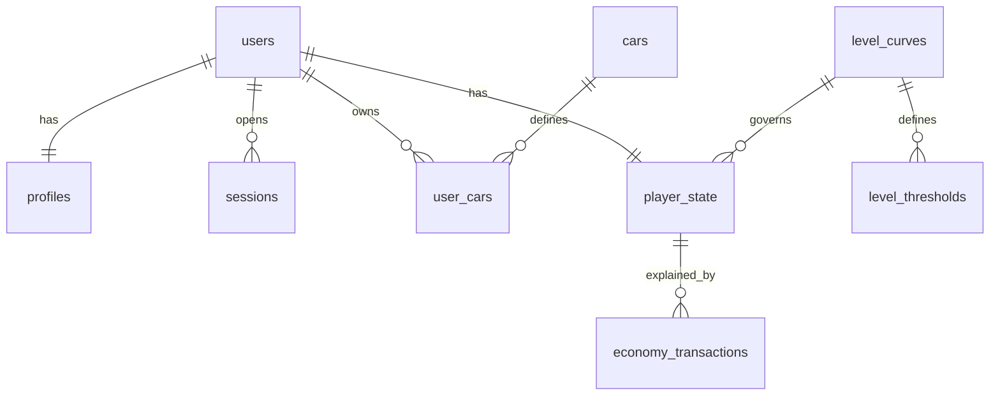
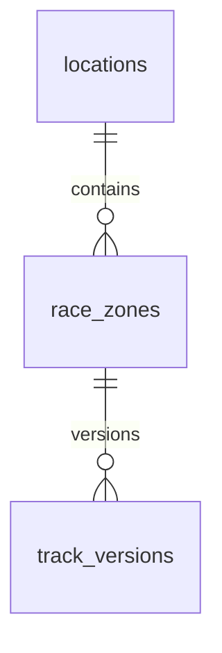

# Database schema and operations

The only migration source is `backend/alembic/`. Revisions `0001` (schema/security) and
`0002` (catalog) run in the `game` schema. PostGIS is enabled by the database administrator
before Alembic. Runtime role cannot create extensions/tables or change reference catalogs.

| Table | Key data / invariant |
|---|---|
| users | UUID, normalized unique email, Argon2id hash, verification flag/time, active flag |
| profiles | UUID, unique user FK, normalized unique username, display name/avatar/country, timestamps |
| sessions | user FK, access/refresh hashes, separate expirations, absolute expiry, revocation |
| used_refresh_tokens | unique consumed token hash, session FK; detects replay until session retired |
| account_tokens | purpose verify/reset, hash, expiry, one-use timestamp |
| cars | immutable runtime catalog; one starter definition; bounded tuning statistics |
| user_cars | owner + car FKs, acquisition kind, selected flag; partial unique starter/selection indexes |
| level_curves | named versioned curve |
| level_thresholds | curve+level PK and unique XP threshold; proposed 0/1000/3000/6000/10000 |
| player_state | user PK, coins, XP, curve version, updated timestamp; nonnegative balances |
| economy_transactions | signed coin/XP deltas, reason and reference, timestamp; unique user/reference |
| outbox_messages | encrypted email payload, expiry, retry time/count, delivery timestamp |
| rate_limits | HMAC-hashed account/IP scope, fixed window, atomic hit count |
| locations | public city, planned/available, geography(Point,4326), GiST index |
| race_zones | location FK, draft/review/published/retired, valid geometry(MultiPolygon,4326), GiST |
| track_versions | zone FK, version, draft/published/retired, manifest/hash; no generated tracks |





Registration inserts the user/profile, zero state, one selected starter, opening ledger
entry and encrypted verification mail in one transaction. Unique constraints prevent
concurrent duplicates. Selection serializes on the user row, clears the old selected
flag, then sets only an owned enabled car. No client-supplied user ID is trusted.

## Economy accounting

Only INSERT on the ledger can change coins/XP through a SECURITY DEFINER trigger with
fixed search_path. The API role has no UPDATE privilege on player_state and no UPDATE
or DELETE privilege on the ledger. A trigger also prevents ledger edits by ordinary
owner DML. The DBA can still alter the schema: this is not protection against a DBA
compromise. Compensations must be new entries. A failed debit/XP reduction rolls back
both the insert and balance change. The internal service's unique reference protects
retries and rejects conflicting reuse. There is intentionally no economy mutation API.

The initial opening entry has zero deltas. To explain a user's coins with restricted
operational access:

```sql
SELECT kind, coins_delta, xp_delta, reference_type, reference_id, created_at
FROM game.economy_transactions
WHERE user_id = :user_id
ORDER BY created_at, id;

SELECT s.user_id, s.coins, s.xp,
       coalesce(sum(t.coins_delta), 0) AS ledger_coins,
       coalesce(sum(t.xp_delta), 0) AS ledger_xp
FROM game.player_state s
LEFT JOIN game.economy_transactions t ON t.user_id = s.user_id
GROUP BY s.user_id;
```

`:user_id` is a bound parameter, never string interpolation. Reconciliation should run
periodically before introducing actual rewards/spending. Level is the maximum configured
threshold reached by XP. Current curve caps at level 5, intentionally provisional;
add a reviewed curve/migration and change DEFAULT_CURVE_VERSION for new accounts.
Existing players retain their pinned curve unless explicitly migrated.

## Geography

City centers are deliberately coarse public catalog values, not survey/map source data.
No race zones/track versions are seeded, no route is playable, and no player-coordinate
field exists. Future nearby search can use ST_DWithin on boundary::geography in metres;
the matching expression GiST index is prepared. Validate future polygon coordinate
ranges and publication rights. Nearby queries must operate on a coarse user-selected
area and must not expose a player's precise origin. Do not infer home from city selection.

## Migration and retention policy

Do not modify an applied revision; add another. Take a backup and test restore before
production migrations. Downgrades destroy data and can be blocked by referenced catalog
rows; they are only for disposable development DBs. Alembic does not create schemas at
application startup. Do not use Base.metadata.create_all as a second migration path.

The outbox worker deletes old rate-limit rows and scrubs delivered/expired mail payloads.
Before external launch, add a privileged scheduled retention job for expired sessions,
consumed token families (after absolute session expiry), account tokens, and delivered
outbox metadata; implement account deletion/pseudonymization and backup expiry. The
runtime role cannot freely delete account/history rows.
